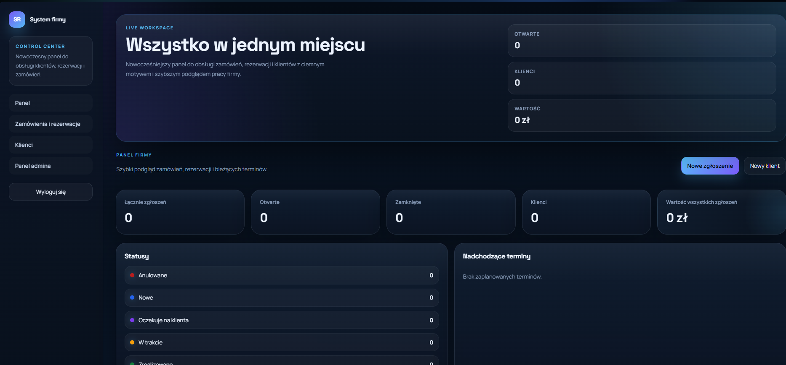
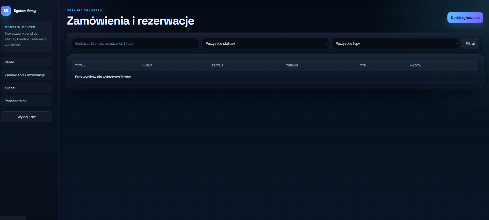
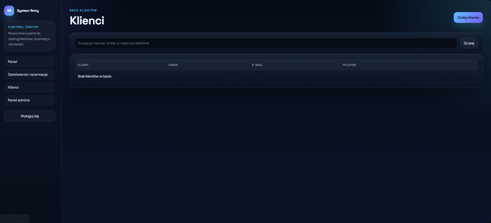

# System rezerwacji / zamowien

Prosty projekt w Django do obslugi klientow, zamowien i rezerwacji dla firmy.

## Co jest w srodku

- logowanie uzytkownika
- panel startowy z podsumowaniem
- baza klientow
- formularze dodawania i edycji
- statusy oparte o baze danych
- panel admina Django

## Jak uruchomic

```bash
python manage.py migrate
python manage.py createsuperuser
python manage.py runserver
```

Po uruchomieniu:

- panel aplikacji: `http://127.0.0.1:8000/`
- panel admina: `http://127.0.0.1:8000/admin/`

## Domyslne statusy

Migracje tworza podstawowe statusy:

- Nowe
- W trakcie
- Oczekuje na klienta
- Zrealizowane
- Anulowane

<h2>Zrzuty ekranu</h2>

<p align="center">
  
  
  
</p>

